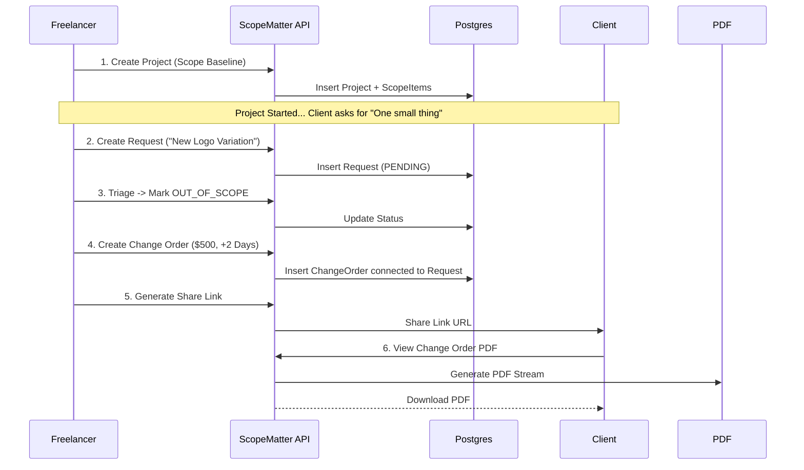

# ScopeMatter Backend Architecture

> **"Trust is the currency of the freelancer economy. This architecture is the vault."**

This document serves as the **Technical Manifest** for the ScopeMatter Backend. It goes beyond folder structures to explain the *mental model*, *trade-offs*, and *critical paths* that drive this system.

---

## 1. System Mental Model

ScopeMatter is a **Scope & Change Order Management Engine** designed to solve a specific friction point: "Scope Creep."

Architecturally, it is a **Layered Monolithic REST API** built on **Node.js/Express**. It acts as the authoritative state machine for:
1.  **Project Baselines**: Defining what *is* agreed upon.
2.  **Request Triage**: Funneling client feedback into structured data.
3.  **Commercial Resolution**: Converting "extra work" into formal, priced "Change Orders."

### The "Trust Engine" Interaction Model
```mermaid
graph TD
    User[Freelancer] -->|Auth (Clerk)| API[Express API Layer]
    Client[Client Read-Only] -->|Public Token| API
    
    subgraph "Core System"
        API -->|Validate| Zod[Zod Schema Layer]
        Zod -->|Process| Svc[Service Layer]
        
        Svc -->|Read/Write| DB[(PostgreSQL + Prisma)]
        Svc -->|Cache Hot Data| Redis[(Upstash Redis)]
        Svc -->|Generate| PDF[PDF Engine]
    end
```

---

## 2. Engineering Cognition: Decision Logs

We don't choose technologies because they are popular; we choose them because they solve specific constraints.

### Decision 1: Type-Safe ORM (Prisma) vs. Raw SQL
*   **Context**: The domain involves complex relationships: `Project` -> `Requests` -> `ChangeOrders` -> `AppUsers`.
*   **The Choice**: **Prisma ORM**.
*   **Why**: We traded *raw execution speed* for **development velocity and correctness**. The "Safe-Typing" across the stack (Database -> API -> Client) prevents an entire class of "undefined is not a function" runtime errors. The schema serves as the single source of truth.
*   **Trade-off**: Slightly higher memory footprint on cold starts, mitigated by efficient indexing and connection pooling.

### Decision 2: Write-Through Caching (Redis)
*   **Context**: Dashboard metrics (Growth calculations, "Active Projects") are computationally expensive to aggregate on every page load.
*   **The Choice**: **Upstash Redis (Serverless)**.
*   **Why**: Dashboard reads outnumber writes 50:1. We implement a **Write-Through** strategy.
    *   *Read*: Check Cache -> Return.
    *   *Write*: DB Update -> **Invalidate** specific cache keys immediately.
*   **Trade-off**: Complexity in invalidation logic (e.g., Creating a Request must invalidate the Project Dashboard). We accepted this complexity to guarantee sub-50ms dashboard loads.

### Decision 3: Token Hashing for Share Links
*   **Context**: Public share links allow clients to view project scopes without logging in.
*   **The Choice**: **SHA-256 Hashing of Tokens**.
*   **Why**: We treat share links like passwords. We strict-store `sha256(token)` in the database, not the raw token.
    *   *Scenario*: If the database is leaked, the attacker generally cannot reverse-engineer the active links to view private project data.
*   **Trade-off**: We cannot "recover" a lost link for a user; we must revoke and regenerate it. A worthy trade for security.

---

## 3. Technical Depth: Core Mechanisms

### The "Change Order" State Machine (Complex Feature)
The system's most critical logic facilitates the transition of a vague "Request" into a binding "Contract."

**Data Flow**:
1.  **Ingestion**: `Request` created with status `PENDING`.
2.  **Triage**: Freelancer marks it `OUT_OF_SCOPE`.
3.  **Formalization**: A `ChangeOrder` is attached to the Request.
    *   *Validation*: Price must be positive; Request must be Out of Scope.
4.  **Closure**: `ChangeOrder` status moves to `APPROVED` or `REJECTED`.
    *   *Constraint*: Once a Change Order exists, the parent Request is locked.

### Security & Integrity Patterns
*   **Authentication**: Delegated to **Clerk**. We verify `Auth-Tokens` at the edge, ensuring no unauthenticated request touches our business logic.
*   **Validation boundary**: `Zod` middleware (`validateBody`) intercepts 100% of mutations.
    *   *Principle*: "Parse, don't validate." We don't just check if `price` is a number; we parse it into a specific Domain Type before the controller sees it.
*   **Authorization**: Resource-level checks (e.g., `project.userId === req.user.id`) are enforced in the *Service Layer*, not just the Controller, preventing "Insecure Direct Object Reference" (IDOR) attacks.

---

## 4. Visualization: Critical Workflows

### Primary User Workflow: The "Scope Defense" Loop
How a freelancer protects their time.



---

## 5. Compliance & Operations

### Zero-Friction Deployment
*   **Environment Sovereignty**: Configuration is strictly decoupled via `src/config/env.ts`. No hardcoded secrets.
*   **Database Migrations**: Managed via `prisma migrate deploy` in the CI pipeline, ensuring schema consistency before code deployment.
*   **Health Audits**: `GET /health` endpoint provides an instant heartbeat for load balancers (K8s/AWS ALB).

### Local Development
*   **Seed Data**: `npm run prisma:seed` hydrates the DB with a realistic "Golden Path" dataset (User -> Client -> Project -> Scope).
*   **Type Compliance**: `npm run build` runs a full `tsc` pass, ensuring no "any" types leak into production.
